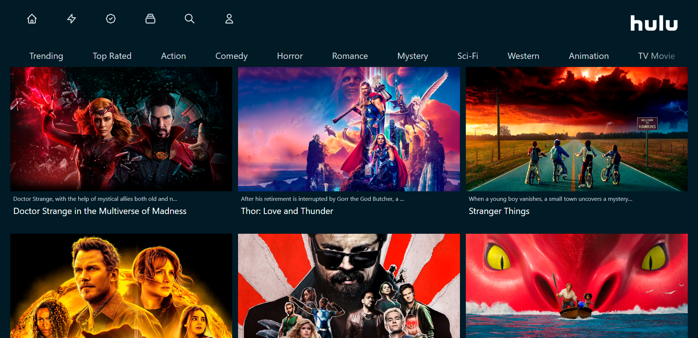

<div align="center">
  

</div>

<p align="center" style="margin-top: 35px">
  
</p>


## Sobre o Projeto
Atividade seguindo tutorial Hulu 2.0 clone [Sonny Sangha](https://www.youtube.com/watch?v=MqDlsjc8GLo). A aplicação é um exercício com [NextJs](https://nextjs.org/) e [tailwindcss](https://tailwindcss.com/) onde consumimos a api [themoviedb](https://www.themoviedb.org/) e atualizamos o catalogo de filmes em tela de acordo com a categoria.

### 🛠 Tecnologias
As seguintes ferramentas foram usadas na construção do projeto:

- <a href="https://nextjs.org" > Next.js </a>
- <a href="https://tailwindcss.com/"> Tailwindcss </a>
- <a href="https://www.themoviedb.org/"> Themoviedb </a>

### 🎲 Rodando o projeto

```bash
# Instale as dependências
$ yarn install
# ou
$ npm install

# Execute a aplicação
$ yarn dev
# ou
$ npm run dev
```
